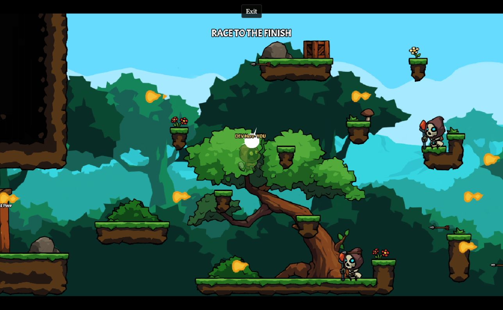

<p align="center">
  
</p>

# The Hooded Hero — Ludicord Edition

The original pixel platformer by **[Tandid Alam (@Tandid)](https://github.com/Tandid)**, adapted for Discord Activities with **Ludicord 4.2, React and Phaser** by **[mrcholer](https://github.com/mrcholer)**. Play three solo story stages with the original enemies, combat and boss, or race with 2–4 friends in a Discord Activity.

Original source: [Tandid/The-Hooded-Hero-V2](https://github.com/Tandid/The-Hooded-Hero-V2). Its [original README](docs/UPSTREAM_README.md) and [MIT license](LICENSE) are preserved. The migration does not claim authorship of the original game.

The upstream repository is MIT-licensed, allowing cloning, modification and publication with its copyright and license notice retained. This is an independent adaptation, with no claim of endorsement by the original creator. See [attribution and reuse](docs/ATTRIBUTION.md) for the verified source, license conditions and asset notes.

**Three story stages · 2–4 player Discord races · WASD / ZQSD / arrows · Xbox / PlayStation controllers**

[Quick start](#local-development) · [How to play](#playing) · [Controls](#controls) · [Discord setup](#discord-setup) · [Production](#production) · [Contributing](#contributing)



One Ludicord application serves the React menus, Phaser game, Discord authentication and multiplayer WebSocket. There is no separate Express server, room-password service or database to install.

## Playing

- **Story Mode** starts level one. **Continue Adventure** resumes the last entered level on this browser, rather than an exact checkpoint or running combat session. **Level Select** opens the original Phaser stage selector.
- **Play Together** opens the party belonging to your authenticated Discord Activity instance. Choose an animated hero, mark ready, and let the leader start. Every connected participant must finish loading before the server starts the shared countdown.
- The original race retains unlimited respawns and collision knockback. The server records finish order and elapsed time. Results offer Play Again, Change Hero, Story Mode and Main Menu. Only the leader can reset the party for a rematch.
- Late arrivals wait for the next lobby. Exit withdraws from the current race. A brief socket loss retains hero, position and finish state for 25 seconds, then removes the player and transfers leadership. Set `LUDICORD_RECONNECT_WINDOW_MS` to change the grace period (5–120 seconds).

## Controls

Keyboard and controller input work in **Story Mode and the race**. Connect a controller over USB or Bluetooth, focus the Activity, press a button, then release it. The toolbar shows when the browser detects it. One controller controls your local hero; friends use their own Discord clients.

| Action | Keyboard | Xbox | PS4 / PS5 |
| --- | --- | --- | --- |
| Move left / right | **Q or A / D**, or **← / →** | Left stick / D-pad | Left stick / D-pad |
| Jump / double jump | **Z, W, ↑ or Space** | A | Cross ✕ |
| Sprint, hold | **Shift** | RB | R1 |
| Bow, Story Mode | **R** | B | Circle ○ |
| Sword, Story Mode | **E** | X | Square □ |
| Pause / resume | **Esc or P** | Menu / Start | Options |
| Navigate menus | **ZQSD, WASD or arrows** | Left stick / D-pad | Left stick / D-pad |
| Select a menu item | **Enter or Space** | A | Cross ✕ |
| Back in menus | **Esc** | View / Back | Share / Create |

**Q now moves left; the bow moved from Q to R** so AZERTY movement never fires an arrow accidentally. S / ↓ moves down in menus; the original platformer has no crouch action. Combat belongs to Story Mode; the race retains its original movement and collision knockback.

Story Mode pauses when the new pause menu is open. A multiplayer race keeps running for the other players; opening your race menu stops local movement without stopping the shared clock. Inputs reset when you switch screens or lose focus. A controller must return to neutral after connection, refocus or a screen change, preventing held buttons from triggering a second action.

### Controller setup and remapping

The game uses the browser [Gamepad API and standard mapping](https://www.w3.org/TR/gamepad/). Xbox controllers, DualShock 4, DualSense and other controllers exposed by the browser use the standard layout above. Hardware, drivers, operating systems and the embedding browser determine which devices are available; the application cannot grant controller access denied by a Discord frame.

In **Settings → Controller**:

1. Check the connected device name and whether the browser supplies a standard or custom mapping.
2. Adjust the stick deadzone if your hero moves without touching the stick. The default is 20%; analog movement scales smoothly outside it.
3. For a custom layout, open **Remap buttons**, choose an action, release the controls and press its replacement button. Jump also selects menu items. You can disable unused bindings.
4. Choose horizontal / vertical axes and inversion for controllers with different stick layouts. The vertical axis navigates menus.
5. Select **Save Controller**. Mappings persist on this browser. **Reset to Default** restores the standard layout after you save it.

Gamepad navigation includes the React menus, hero selection, results and the original Phaser stage selector and dialog buttons. Mouse and keyboard remain available for audio sliders. Vibration and platform-specific controller drivers are not required or supplied.

Original Story Mode HUD, restart, home and settings buttons remain. Music/effects volume and mute persist locally. Phaser FIT scaling preserves the 1280×720 aspect ratio with letterboxing.

## Local development

Use Node.js **20.19+** or a compatible newer LTS and npm. Run commands from this project directory:

```sh
npm ci
```

Copy `.env.example` to `.env.local`. On Windows PowerShell use `Copy-Item .env.example .env.local`; on macOS/Linux use `cp .env.example .env.local`. Keep `.env.local` private.

Set `LUDICORD_SESSION_SECRET` to at least 32 random characters. Generate it locally with:

```sh
node -e "console.log(require('node:crypto').randomBytes(32).toString('hex'))"
```

To use Ludicord's official browser development identity, set:

```env
LUDICORD_DISCORD_CLIENT_ID=local-hooded-hero
LUDICORD_DEV_FAKE_AUTH=true
LUDICORD_DEV_DISPLAY_NAME=DEV Hero
LUDICORD_DEV_INSTANCE_ID=local-adventure-party
```

```sh
npm run dev -- --port 3200 --host 127.0.0.1
```

Open **http://localhost:3200/**. Local identity is supplied by Ludicord, not a username form or an application identity override. Production rejects development sessions. Use real Discord credentials for testing through a public tunnel.

For a local party smoke test, run this in another terminal:

```sh
node scripts/dev-peer.mjs
```

This labeled stationary DEV peer selects a hero and becomes ready. It does not render Phaser, simulate collisions or finish a race; it does not substitute for two real Discord clients. It is fixed to loopback port 3200 and requires fake auth in `.env.local`. Stop with Ctrl+C.

## Discord setup

1. Enable Activities for your Discord application and configure its supported desktop platforms.
2. Set the real `LUDICORD_DISCORD_CLIENT_ID`, server-only `LUDICORD_DISCORD_CLIENT_SECRET` and `LUDICORD_SESSION_SECRET`. Remove fake-auth settings for real Discord testing.
3. Configure the OAuth redirect URI for the Ludicord Embedded App SDK authorization flow. Current scopes: `identify`, `guilds`, `rpc.voice.read`.
4. Expose the server over HTTPS. For a temporary development URL:

   ```sh
   cloudflared tunnel --url http://localhost:3200
   ```

5. Add the tunnel/deployment hostname to `LUDICORD_ALLOWED_HOSTS`, without a scheme or path. Multiple names are comma-separated. Defaults accept localhost/loopback only. Ludicord automatically recognizes this application's exact Discord proxy hostname.
6. Map Activity URL prefix **`/`** to that HTTPS hostname, without the protocol. The same server serves the page, assets, auth and `/ws/adventure`. Preserve WebSocket upgrades in your proxy.
7. Launch the unpublished Activity from the Developer Activity Shelf/App Launcher. With a second Discord account, verify party → ready → countdown → race → results → rematch.

`LUDICORD_DISCORD_BOT_TOKEN` is optional and activates framework Activity Instance verification under `auto`. `LUDICORD_DISCORD_PUBLIC_KEY` is available when a deployment explicitly enables proxy signature verification; the current config leaves that optional verification disabled. These secrets remain server-only. Multiplayer messages cannot supply trusted Discord identity or choose a different Activity instance.

## Production

Set real credentials and `LUDICORD_ALLOWED_HOSTS` in the server environment:

```sh
npm ci
npm run build
npm start -- --port 3200
```

Retain `.ludicord` build output and `public/` in the runtime image. Serve HTTPS, proxy WebSocket upgrades, and avoid caching auth/socket routes. This version uses **one Node process** with transient in-memory party state; restart or server-module hot replacement resets parties. A broadcast adapter alone does not make this custom engine safe across replicas. No separate Express server or database is required.

## Checks and code map

```sh
npm run typecheck
npm test
npx ludicord routes
npx ludicord lint
npm run build
```

| Path | Responsibility |
| --- | --- |
| `app/page.tsx`, `app/game/embed.tsx` | Activity root and game entry |
| `app/auth/` | Automatic authentication states |
| `components/activity/ActivityShell.tsx` | Menus, lobby, loading, settings, results |
| `app/ws/adventure/socket.ts` | Authenticated WebSocket route |
| `game/server/party-engine.ts` | Authoritative party, loading, timing, checkpoints, results |
| `game/shared/types.ts` | Shared protocol types |
| `lib/adventure-network.ts` | Phaser network adapter without per-frame React updates |
| `lib/input-model.ts`, `lib/game-input.ts` | Shared keyboard/gamepad mapping, edges, focus and device lifecycle |
| `components/activity/GameControls.tsx` | Control guide, device status and saved remapping |
| `lib/menu-navigation.ts`, `src/game/controller-navigation.ts` | Keyboard/controller navigation across React and Phaser menus |
| `src/` | Original Phaser scenes, entities, combat, HUD and map systems |

Movement sends at approximately 20 Hz with remote interpolation, sequence/bounds/velocity/displacement checks and framework rate limits. This is practical race validation, not a fully server-simulated physics or anti-cheat engine. See [migration notes](docs/MIGRATION.md).

The automated suite covers authenticated WebSockets, party authority, reconnect/rematch, AZERTY mappings, standard/custom gamepads, analog deadzones, press edges and menu repeat timing. Controller mappings are tested with synthetic device snapshots; physical Xbox / PS4 / PS5 hardware and controller access inside a real Discord frame still need a device smoke test.

## Troubleshooting

| Problem | Check |
| --- | --- |
| Controller does not appear | Connect through your OS, focus the game and press/release a button. Use HTTPS or localhost and a browser with Gamepad API support. |
| Controller works in a browser but not Discord | The frame may block the `gamepad` permission. Read the device message in Settings; use keyboard controls when access is denied. |
| Wrong buttons or stick direction | Open Controller settings, remap the buttons, adjust axes/inversion and save. Generic devices may have no standard mapping. |
| Hero drifts or a held button seems ignored | Increase the deadzone for drift. Release all controls after changing screens, reconnecting or returning focus. |
| `LUDICORD_HOST_NOT_ALLOWED` | Add the exact tunnel/deployment hostname to `LUDICORD_ALLOWED_HOSTS`, then restart. A new Quick Tunnel has a new hostname. |
| Alone in the party | Both players must launch the same authenticated Discord Activity instance. Different instances are deliberately isolated. |
| Countdown waits indefinitely | Every participating client must finish loading. Check failed asset requests; late joiners wait for the next lobby. |
| No sound | Interact with the page, then check music/effects sliders and mute in Settings. |

## Contributing

Keep the original pixel-art presentation, game balance and upstream credit. Use the existing Ludicord routes and shared input layer when adding actions, rather than creating a second keyboard or socket system. Run typecheck, tests, hooks lint and a production build before submitting changes.

For input changes, test Story Mode and a race, both keyboard layouts, arrow keys, a standard pad, a custom mapping, disconnect/reconnect and focus loss. For networking changes, also verify two real Discord clients in one Activity instance. Describe which devices and Discord/browser versions you tested; do not treat the local stationary peer as a real second player.

## Credits and assets

Original game credit belongs to **Tandid Alam (@Tandid)** and upstream contributors. **mrcholer** maintains this Ludicord adaptation. The original MIT license is unchanged, including its Phaser template copyright notice. The adaptation changes the application shell, Discord party networking, input/controller support, lifecycle and deployment integration.

Please credit the original creator when sharing this edition. The game title and original artwork are retained to identify the original project; this fork does not claim exclusive ownership of them.

Acme font metadata identifies Juan Pablo del Peral and SIL OFL 1.1; its notice is included beside the font. Other artwork/audio sources were not individually documented upstream. See [asset audit](docs/ASSET_LICENSE_AUDIT.md) and its hash inventory before redistribution. The code license alone does not establish every asset's license.
